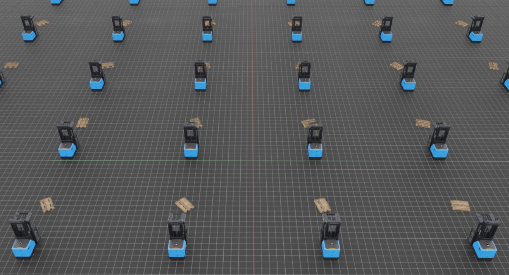

# Code Description

## forklift_empty_envs1

**Only forklift** in each 64 envs

## forklift_empty_envs2

Both **forklift and pallet** in each 64 envs

## forklift_empty_envs3

Set **pallet's rotation randomly**

## forklfit_empty_envs4

**Final environments**
